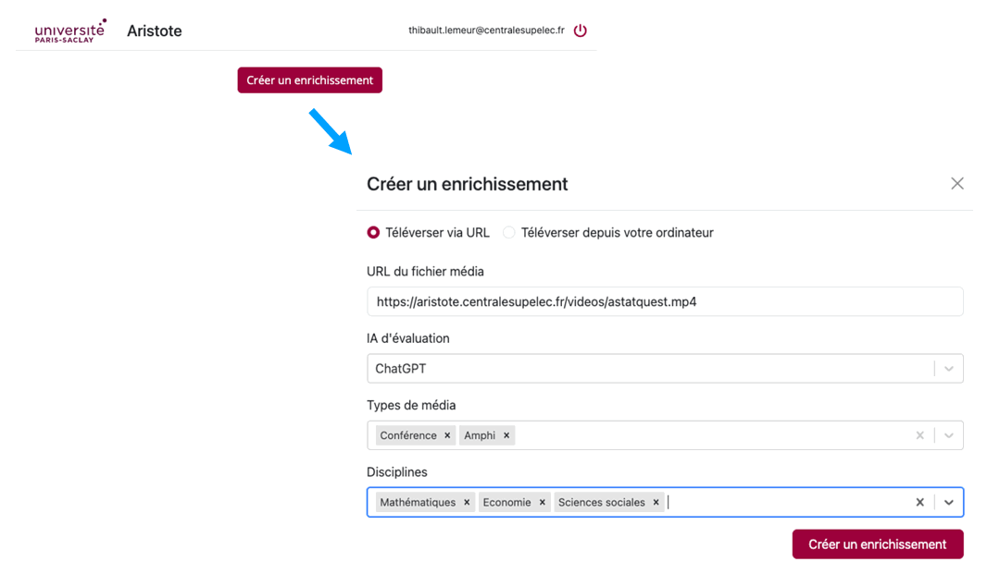
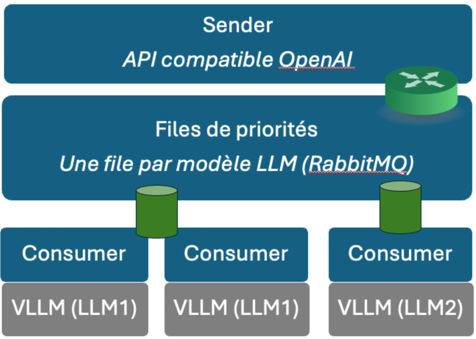
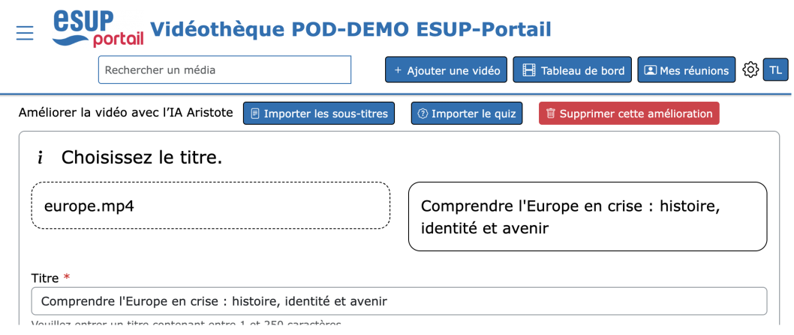

# Bienvenue sur le site du projet Aristote.

Lors de la conférence IA & Education des 8 et 9 juin 2023, un [prototype de l'application Aristote](https://webtv.centralesupelec.fr/videos/aristote/) a été présenté.
Il répondait aux attentes des étudiants en rendant les vidéo plus facile à utiliser pour leurs révisions.

<figure markdown>
{ width="750" }
<figcaption>Prototype Aristote (Conférence IA & Education 2023)</figcaption>
</figure>

Aristote est un [logiciel libre](opensource.md) qui utilise l'IA (intelligence artificielle) afin de transformer des vidéothèques pédagogiques en ressources d'apprentissage enrichies:

- en produisant une retranscription de l'audio sous forme de texte qui peut être synchronisé avec la vidéo et dans lequel les recherches sont facilitées
- en traduisant optionnellement ces retranscriptions pour générer par exemple des fichiers de sous-titre dans une autre langue
- en classifiant les vidéos selon des thématiques
- en proposant un titre, une description, des mots clés
- en générant des quiz sous forme de questions/réponses intégrables aux vidéos ou exploitables dans une plateforme d'apprentissage en ligne (comme Moodle)

Outre les fichiers vidéo, d'autres ressources peuvent être traitées par Aristote:

- des fichiers audio
- des fichiers de sous-titre (SRT ou VTT)

## Diffuser Aristote au plus grand nombre d'étudiants

Afin de toucher le plus d'étudiants possible, il est important de convaincre les enseignants qui sont garants des contenus pédagogiques mis à disposition. A ce titre plusieurs critères doivent être réunis:

- l'enseignant doit rester maître des contenus proposés et doit donc pouvoir valider ou modifier les propositions faites par l'IA
- l'usage de LLM non souverain pose problème quant aux conditions d'utilisation des données générées et à la fuite d'informations importantes pour l'amélioration future du service
- l'enseignant doit pouvoir accéder à ce service directement via ses outils de production de contenu actuels

Par conséquent, le projet:

- propose une [API](https://api.aristote.education/api/doc) qui permet d'intégrer la technologie Aristote dans des produits d'enseignement
- propose un [portail de démonstration](https://portail.aristote.education/login) permettant de tester Aristote
- propose une infrastructure permettant de répartir la charge de travail sur des serveurs distants
- permettra de capitaliser sur les données produites et captées sous forme de retour utilisateurs: production de banques de ressource, amélioration des IA (fine tuning), développement de nouveaux services basés sur ces données par des EdTech partenaires

## Architecture du composant de traitement des ressources
### Une API pour traiter les ressources pédagogiques
Aristote consiste tout d'abord en une [API](https://api.aristote.education/api/doc) qui permet d'accéder aux services de l'IA: 
<figure markdown>
{ width="750" }
<figcaption>API Aristote pour les applications pédagogiques</figcaption>
</figure>

Cette API a été conçue en collaboration avec France Université Numérique et l'équipe du projet ESUP-Pod.

### Un portail de démonstration
Afin de permettre aux enseignants de tester la solution avant la mise à disposition de la technologie Aristote dans leurs outils, nous avons développé un portail permettant de produire des quiz et autres enrichissements (production de métadonnées, de sous-titres, de prise de note):
<figure markdown>
{ width="750" }
<figcaption>Portail de démonstration Aristote</figcaption>
</figure>

### Un traitement à distance des vidéos
Afin de répartir les ressources informatiques requises pour le traitement des vidéos, une architecture à base de **workers** a été mise en place. Chaque **worker** possède un rôle précis (retransription de l'audio, génération de quiz et de métadonnées, traduction), et s'authentifie auprès d'Aristote pour récupérer ses tâches.
<figure markdown>
{ width="750" }
<figcaption>Principe d'architecture de l'infrastructure Aristote</figcaption>
 </figure>

Cette architecture permet de mobiliser des ressources de calcul dans plusieurs établissements, même temporairement lorsqu'elles ne sont pas utilisées.

### Un accès au LLM mutualisé avec gestion de priorités

Afin de générer des informations de bonnes qualité, la pertinence du LLM est essentielle. Nos tests ont montré qu'actuellement le plus petit modèle utilisable dans notre contexte est un modèle Llama3 à 70 milliards de paramètres. Ceci suppose donc une infrastructure de calcul GPU importante, qu'il faut mutualiser pour la rentabiliser financièrement et la rendre écologiquement responsable (la multiplication de serveurs GPU dans les établissements auraient une empreinte environnementale néfaste).

Nous avons donc développé le projet Aristote-Dispatcher, un répartiteur de charge de requêtes LLM capable de gérer aussi des niveaux de priorités.
<figure markdown>
{ width="550" }
<figcaption>Répartiteur de charge Aristote-Dispatcher</figcaption>
 </figure>

Aristote-Dispatcher exposant une API compatible avec celle d'OpenAI, il peut être utilisé en remplacement de GPT4 dans les **workers** Aristote, mais aussi dans d'autres applications. Par ailleurs, comme il peut gérer des priorités, il peut combiner des usages asynchrones comme le traitement de vidéos d'Aristote pour générer des quiz, avec un traitement synchrone pour des applications interactives comme des chat.
 
## Implémentations dans des outils tiers
<figure markdown>
{ width="750" }
<figcaption>Intégration d'Aristote dans Esup_POD 3.7</figcaption>
 </figure>

- Aristote est désormais intégré dans la version 3.7 d'ESUP-Pod
- France Université Numérique a commencé l'implémentation d'Aristote dans Marsha
- Ubicast, éditeur de la plateforme de VoD Nudgis, proposera une version compatible avec Aristote d'ici la fin de l'année

Profitant de la disponibilité d'une API compatible OpenAI, certains éditeurs proposent d'utiliser Aristote-Dispatcher en remplacement d'accès OpenAI. Cette option est donc désormais disponible dans les outils des éditeurs Nolej.io et Ideta. 

## Disposer d'une infrastructure LLM mutualisée

Pour l’enseignement supérieur, CentraleSupélec s’est associée aux universités de Rennes, Lille, Paris 1 Panthéon-Sorbonne et Reims Champagne-Ardenne pour travailler sur la mutualisation de serveurs d’inférence hébergés dans la fédération de datacentres labellisés, en utilisant un déploiement du projet Aristote-Dispatcher. Ce projet de fédération porte le nom de ILaaS (Inférence LLM as a Service).

